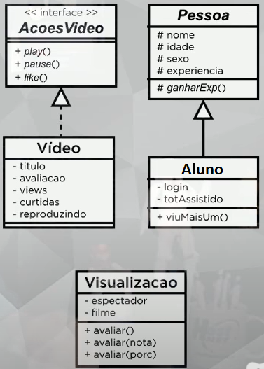

# ProjetoAssitirVideo-PHP-POO  
 Projeto Final do Curso PHP POO (por Curso em Vídeo).  
**Objetivo:**  
  - Criei este repositório para me motivar em meus estudos de PHP e exibir o projeto final do [curso de PHP POO](https://www.cursoemvideo.com/course/php-poo).  
  - Praticar todo o conhecimento adquirido durante o curso.  
  - Usar os recursos de POO: Encapsulamento, Herança, Polimorfismo.  
  - O diagrama de classes (UML) que irei seguir neste projeto está na imagem logo abaixo
  
**Bônus/Melhorias/Obs:**  
  - O **cálculo da média de avaliações apresentado no curso está INCORRETO**, já que toda vez que alguém assistisse um vídeo a nota somada à avaliação  seria dividida por um número maior de views.  
  Para fazer a correção eu criei um novo atributo para a classe Video (*avaliacaoTotal*), neste atributo é armazenado a soma total das avaliações. Além disso, também modifiquei alguns métodos getters e setters da classe *Visualizacao* para se comunicar com esse novo atributo.  
  - Outra melhoria que fiz no código foi modificar o método costrutor da classe *Visualizacao*, para usar o método *viuMaisUm* que já fazia o cálculo necessário.  